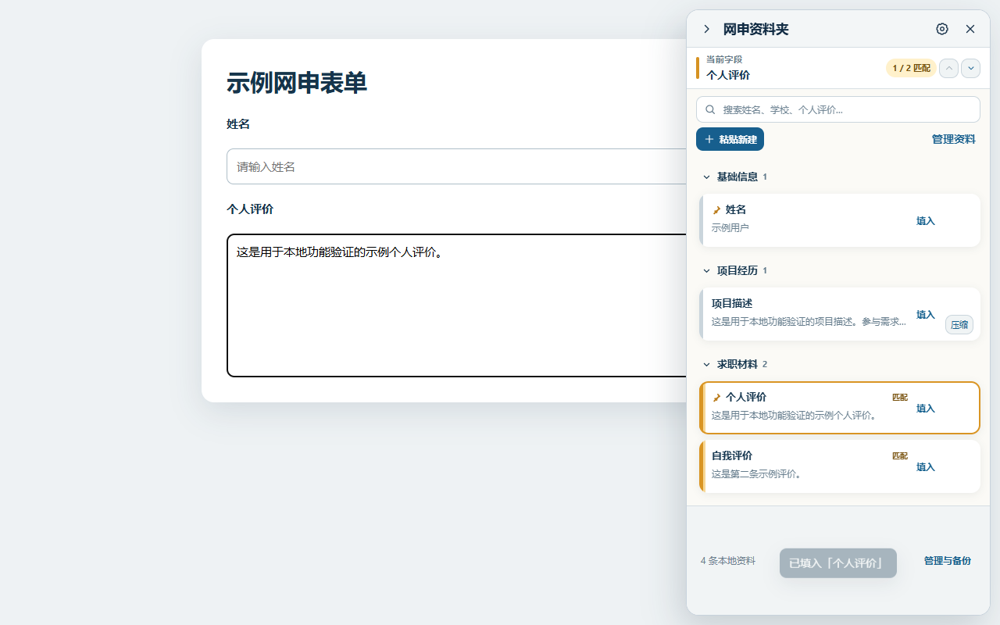
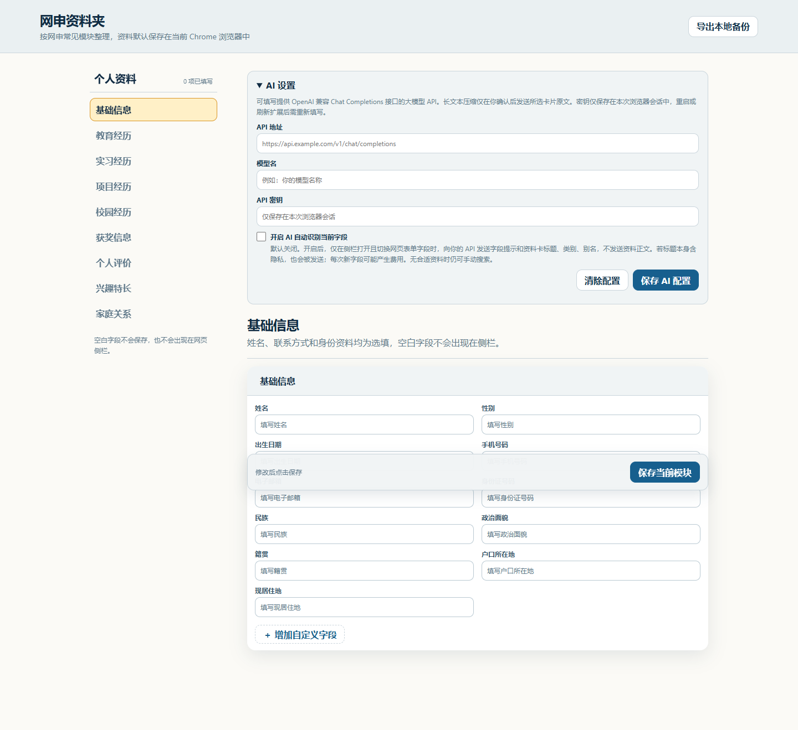

# 网申资料夹

一个适用于 Windows Chrome 的本地网申资料助手。保存常用资料后，点击网页表单，再点击侧栏中的资料卡即可填入。



## 主要功能

- 按基础信息、教育经历、实习经历、项目经历等模块管理资料。
- 识别网页字段并推荐可能匹配的资料，只有点击卡片后才会填入。
- 支持搜索结果和匹配结果的上一项、下一项定位。
- 支持多段经历、自定义多行字段、侧栏粘贴新建和 JSON 备份。
- 可选 AI 长文本压缩和 AI 字段匹配，默认不开启。



## 本地安装

1. 下载或克隆本仓库。
2. 在 Chrome 打开 `chrome://extensions/`。
3. 开启“开发者模式”。
4. 点击“加载已解压的扩展程序”，选择本项目文件夹。
5. 固定“网申资料夹”到浏览器工具栏。

打开扩展的“选项”页面填写资料，然后进入网申网页：先点击需要填写的输入框，再点击侧栏中的对应资料卡。

## 隐私

- 没有后端、账号、广告或分析统计。
- 网申资料保存在当前 Chrome 浏览器的本地存储中。
- 扩展不会自动提交表单，也不会后台监听剪贴板。
- AI 功能需要用户自行配置 API，且默认关闭。AI 匹配不发送资料正文；长文本压缩只在点击“修改”后发送所选内容。
- API 密钥仅保存在当前浏览器会话中，刷新扩展或重启浏览器后需要重新填写。

完整说明见[隐私政策](privacy.html)。

## 本地检查

需要 Node.js 18 或更高版本：

```powershell
npm test
npm run check
```

仓库不包含真实个人资料、API 密钥或用户导出的备份文件。
